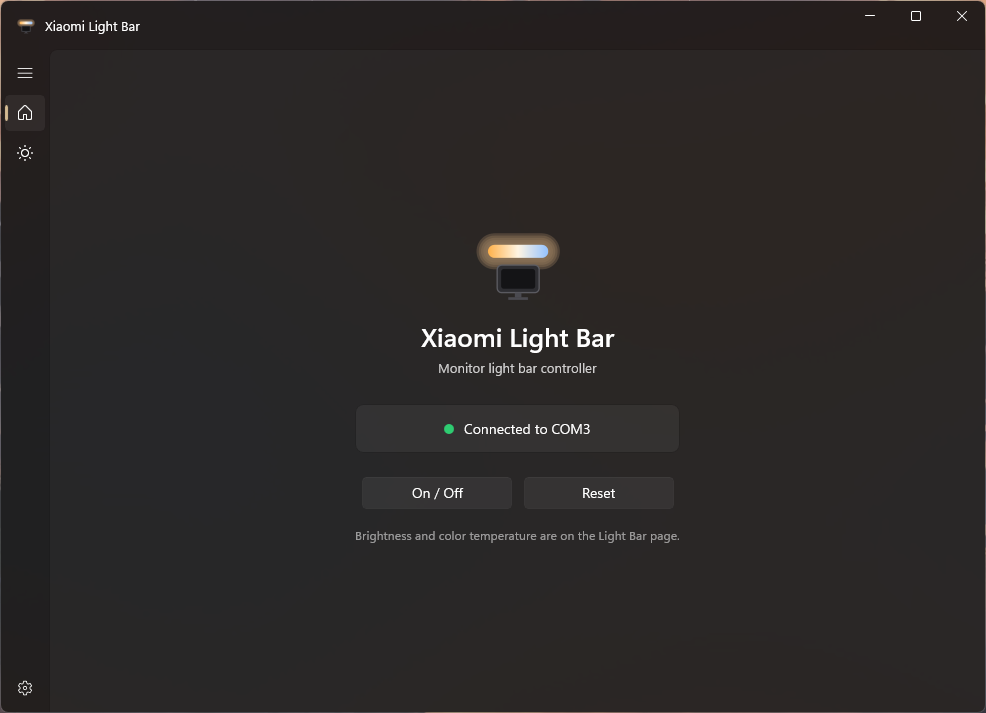
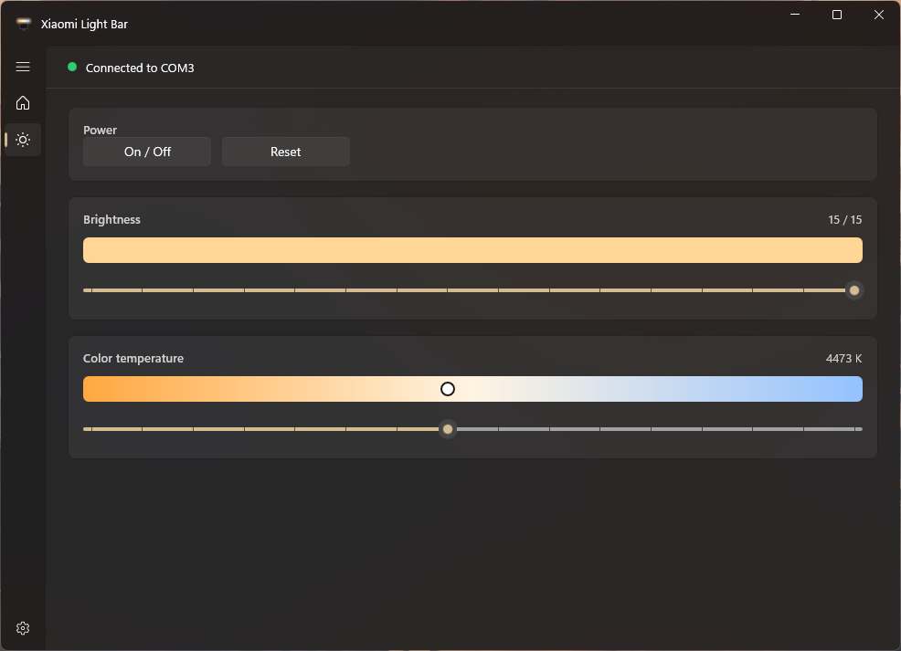
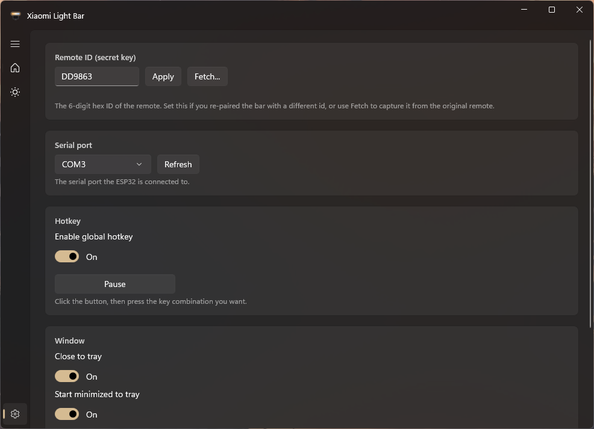

# Xiaomi Light Bar ESP32 + WinUI desktop app

Control a **Xiaomi Mi Computer Monitor Light Bar (MJGJD01YL, non-BLE)** from a Windows desktop app over USB serial, using an **ESP32** and an **nRF24L01(+)** 2.4 GHz transceiver.

## Features

- On/off, reset, brightness and color temperature (0–15)
- Live gradient visualization for color temperature and a fill bar for brightness
- Auto-connect to the ESP32 and automatic reconnect on unplug/replug
- Global hotkey to toggle the light bar from anywhere
- System tray icon with Show / Toggle / Exit and close-to-tray
- Fetch the remote ID directly from the original remote
- Settings persisted to `HKCU\Software\XiaomiLightBar` (theme, hotkey, startup, tray)

## Screenshots

<p align="center">
  <br>
  <b>Home</b>
</p>

<p align="center">
  <br>
  <b>Light bar controls</b>
</p>

<p align="center">
  <br>
  <b>Settings</b>
</p>

## Hardware

ESP32 Dev Module + nRF24L01(+) module. The nRF24L01 is **3.3 V only**.

| nRF24L01 pin | ESP32 pin |
|--------------|-----------|
| GND          | GND       |
| VCC          | 3V3       |
| CE           | GPIO4     |
| CSN          | GPIO5     |
| SCK          | GPIO18    |
| MOSI         | GPIO23    |
| MISO         | GPIO19    |
| IRQ          | -         |

Add a **10–100 µF capacitor across VCC/GND** of the nRF24L01. Power dips are the usual cause of flaky detection.

## Firmware

1. In the Arduino IDE install the **esp32** board package and the **RF24** library (by TMRh20).
2. Open `firmware/xiaomi_lightbar.ino`. Arduino requires a sketch to live in a folder of the same name, so if the IDE offers to move it into `xiaomi_lightbar/`, accept.
3. Select your board (e.g. *ESP32 Dev Module*) and the COM port of the ESP32, then upload.
4. Open the Serial Monitor at **115200** and confirm the board boots. This verifies the ESP32 is set up correctly before you use the app.

### Verify the board works before using the app

Make sure the ESP32 loads in the Arduino IDE so the desktop app can talk to it:

- `Tools → Board` and `Tools → Port` are both set, and upload completes without errors.
- The Serial Monitor prints `READY id=......` after reset.
- Type `PING` and press Enter - the board replies `OK PONG`. This is the exact serial link the app uses.
- **Close the Serial Monitor before launching the app.** Only one program can hold the COM port, and the Arduino IDE will block the app otherwise.

> The app connects to **COM3** by default. Change it under **Settings → Serial port** - use **Refresh** to list detected ports. The port is saved and applied immediately.

The firmware accepts newline-terminated commands over serial:

```
ONOFF  RESET
HIGHER:n  LOWER:n  COOLER:n  WARMER:n   (n = 1..15)
BRIGHT:n  TEMP:n                        (n = 0..15)
ID:ABCDEF   SCAN   STATUS   PING   RAW:0x0201
```

`SCAN` switches the radio to receive mode and reports the original remote's ID.

## Desktop app

Requires Visual Studio 2022 C++ build tools, the Windows SDK, CMake, and the Windows App Runtime.

```powershell
cd desktop
powershell -ExecutionPolicy Bypass -File tools\restore-packages.ps1
cmake --preset x64
cmake --build --preset x64-release
```

Run `desktop/build/Release/XiaomiLightBar.exe`.

## Getting your remote ID

Open **Settings → Remote ID → Fetch…**, hold the original remote next to the nRF24L01 and turn its knob. The app captures and applies the ID.

Alternatively set any 6-hex-digit ID and re-pair: unplug/replug the bar, then apply the ID and press **Reset** within 20 seconds. The bar flashes and is paired to your value (the original remote stops working until re-paired).
